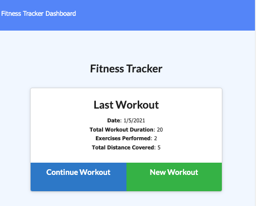

# Introduction

 * As a student developer, the project was to create workout_tracker.  

# Table of Contents

1.  Description
2.  Techologies

#  Description:

  * As a user, the user should be able to veiw create and track daily workouts.  
  * The user able to log multiple exercises in a workout on a given day.  
  * The user able to track the name, type, weight, sets, reps, and duration of    exercise.  
  * If the exercise is a cardio exercise, user should be able to track my distance traveled.  
  * The user will reach their finess goals more quickly when they track their work progress.  

  *  When the user loads the page, they should be given the option to create a new workout or continue with their last workout.

## The user should be able to:

  * Add exercises to the most recent workout plan.

  * Add new exercises to a new workout plan.

  * View the combined weight of multiple exercises from the past seven workouts on the `stats` page.

  * View the total duration of each workout from the past seven workouts on the `stats` page.

# Techologies:
    *  HTML5
    *  CSS3
    *  JavaScript
    *  Node JS
    *  VS-Code Editor
    *  GitHub Repository
    *  Heroku
    *  MongoDB Altas
    *  npm packages

## Repository
- [Heroku App](https://workouttracker315.herokuapp.com/)
- [Project Repo](https://github.com/jinchoo/workout_tracker)